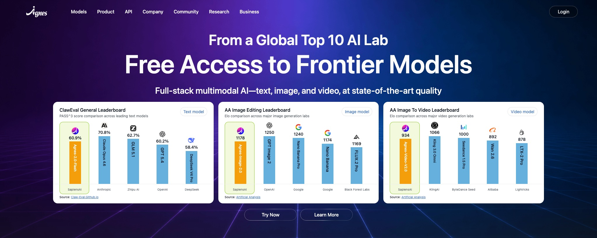
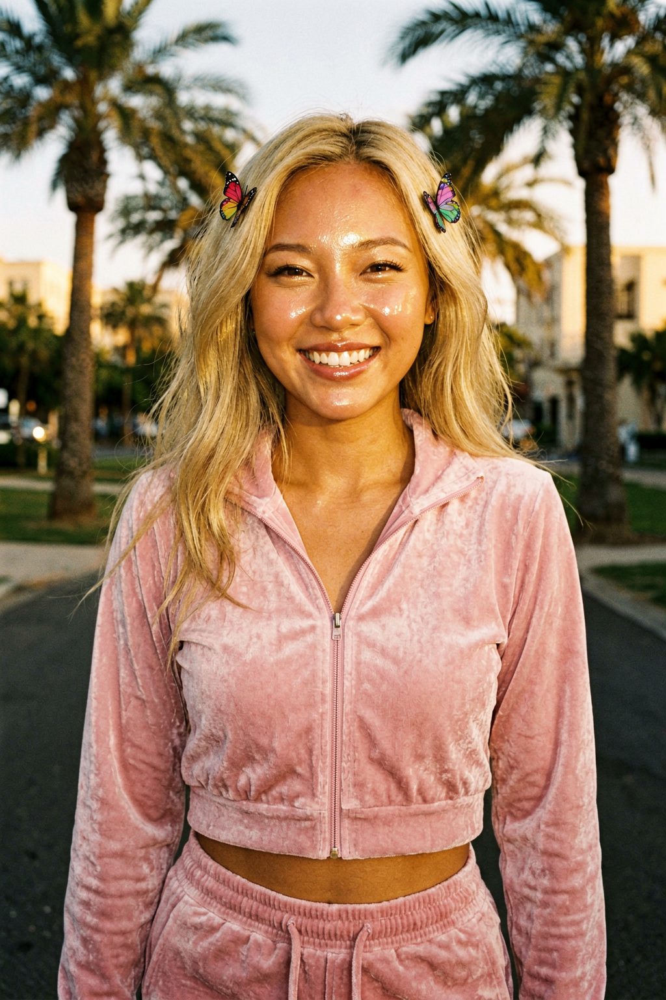
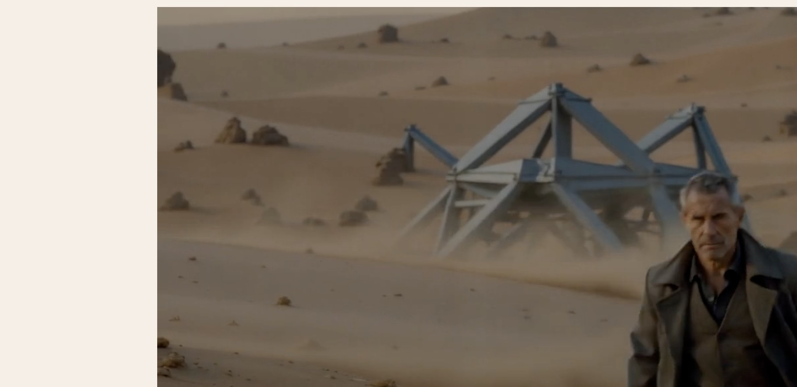
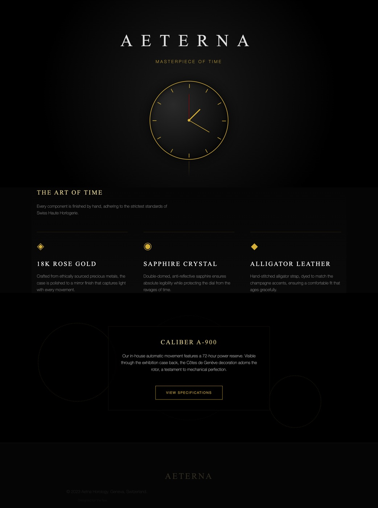

# Agnes AI Skill

[](./LICENSE)
[](./SKILL.md)
[](https://agnes-ai.com/doc)
[](https://platform.agnes-ai.com/)

> One install target for Agnes AI text, image, and video APIs.

> One skill for Agnes AI's full multimodal stack: text, image, and video APIs.
>
> Based on the supplied June 2026 materials, Agnes publicly positioned its core
> multimodal APIs as broadly free to try and attractive for high-frequency
> developer and creator workflows. The live model docs now also include pricing
> sections, so keep the "free" message as a strong but time-sensitive platform
> positioning and verify current commercial terms when spending matters.



This repository packages a single root `SKILL.md` so coding agents can quickly:

- get and persist an Agnes API key
- use `agnes-2.0-flash` for chat, coding, streaming, and tool calling
- use `agnes-image-2.0-flash` and `agnes-image-2.1-flash` for image generation
  and editing
- use `agnes-video-v2.0` for asynchronous video generation and polling

It is designed for the exact pitch that makes Agnes easy to try:

- one provider for text, image, and video
- public free-access positioning that lowers experimentation friction
- agent, creative, and prototyping workflows where repeated calls matter

The skill stays intentionally lightweight. It teaches agents how to make Agnes
API calls successfully without copying the full docs into the repository.

## Dual-Track Layout

This repository stays focused on the installable root skill. The companion
execution layer is designed as a separate CLI package so skill installs do not
pull a full command runtime into `~/.codex/skills` or project-local skill
directories.

The intended split is:

- `agnes-ai-skill`
  - installable root `SKILL.md`
  - setup, model selection, auth guidance, and execution rules for agents
- `agnes-ai-cli`
  - standalone command runner and Node client
  - local-file to public-URL bridge for Agnes image and video workflows
  - normalized video polling and structured JSON output

This keeps the skill lightweight while moving execution details into a tool
that can version and ship independently.

## Install

With a repository-aware skills installer:

```bash
npx skills add jomeswang/agnes-ai-skill -g
```

Because this repository uses a single root `SKILL.md`, installers that support
repository-root skills can discover it directly.

### Verified Install Path

This repository has been validated with:

```bash
npx skills add jomeswang/agnes-ai-skill --list
npx skills add jomeswang/agnes-ai-skill --agent codex --yes
```

The repository is discoverable as a single root-level skill named
`agnes-ai-skill`.

## Preferred Execution Path

The skill repository is the install target. The CLI is the preferred execution
layer when available.

Recommended order:

Supported CLI range for this skill release:

- `>=0.1.0 <0.2.0`

Recommended order:

1. use a local `agnes` binary only when `agnes --version` falls inside
   `>=0.1.0 <0.2.0`
2. otherwise use `npx -y agnes-ai-cli@^0.1.0 ...`
3. keep raw `curl` as the portability fallback

This repository continues to keep `curl` examples because they are the most
portable way to validate Agnes payloads, but the long-term execution model is
skill guidance plus a separate CLI package.

## Model Guide

Use the repository skill with these defaults:

- `agnes-2.0-flash`
  - chat, coding, streaming, tool calling, and agent workflows
- `agnes-image-2.1-flash`
  - default for new text-to-image and image-to-image work
  - strongest fit for denser layouts, richer detail, and better semantic
    alignment
- `agnes-image-2.0-flash`
  - better when you explicitly need its documented `tags: ["img2img"]` flow,
    multi-image composition, or `seed`-based reproducibility
- `agnes-video-v2.0`
  - text-to-video, image-to-video, multi-image guided video, keyframes, and
    asynchronous polling

The official docs also give each model fairly different best practices:

- Image 2.1 leans into high-information-density visuals and composition
  preservation
- Image 2.0 is more explicit about edit/composition workflows, response fields,
  and OpenAI Images-style compatibility
- Video 2.0 is task-based and documents multiple generation modes, task states,
  result polling, and frame-count constraints

## Showcase

The strongest outside prompt libraries all do the same three things well:
lead with a preview, keep the prompt compact enough to scan, and organize
examples by outcome instead of by raw API parameter lists. This gallery follows
that pattern with 9 compact cases regenerated with Agnes on June 1, 2026. The
image prompts were tightened toward the shorter, more editorial style seen in
`awesome-gpt-image-2`, the video prompts were rebuilt around ad-film,
animation, and cinematic beats inspired by `awesome-seedance`, and the HTML
cases were regenerated as brighter, more public-facing product experiences.

### Image Cases

`agnes-image-2.1-flash`

| Preview | Case | Model | Prompt recipe |
| --- | --- | --- | --- |
| [](./assets/images/y2k-golden-hour.png) | Y2K golden hour portrait | `agnes-image-2.1-flash` | Candid blonde portrait, baby-pink velour tracksuit, butterfly clips, glossy lips, palm trees, warm golden hour, real skin texture, soft film grain. |
| [](./assets/images/pencil-editorial-fashion.png) | Pencil editorial fashion | `agnes-image-2.1-flash` | Minimal monochrome pencil-sketch fashion portrait, round sunglasses, rolled white shirt, denim overalls, combat boots, burnt-orange circle, indie magazine composition. |
| [](./assets/images/brand-envelope-perfume.png) | Brand-envelope perfume ad | `agnes-image-2.1-flash` | Dusty-rose brand world, travertine pedestal, translucent perfume bottle, matte cream paper curves, warm studio light, quiet-luxury beauty campaign. |

### Video Cases

`agnes-video-v2.0`

| Preview | Case | Model | Prompt recipe |
| --- | --- | --- | --- |
| [](./assets/videos/ad-film-10s.mp4) | Perfume ad film | `agnes-video-v2.0` | Ten-second luxury commercial with macro bottle details, orbiting reflections, atomizer tension beat, champagne-gold glow, and a final hero reveal built for premium beauty launch pages. |
| [](./assets/videos/animation-film-10s.mp4) | Mechanical otter animation short | `agnes-video-v2.0` | Ten-second animated short: fearless otter pilot bursts through a clockwork engine room, expressive face, hand-painted adventure energy, cinematic action timing, family-film clarity. |
| [](./assets/videos/cinema-film-10s.mp4) | Desert cinematic film scene | `agnes-video-v2.0` | Ten-second widescreen film moment: lone traveler crosses a dust-heavy desert test site, sculptural machine in the background, restrained grading, prestige sci-fi drama mood. |

### App Cases

`agnes-2.0-flash`

Single-file HTML demos generated from Agnes text prompts and saved in
[`examples/apps`](./examples/apps).

| Preview | Case | Model | Prompt recipe |
| --- | --- | --- | --- |
| [](./examples/apps/cinematic-ai-landing.html) | Agnes AI official-style homepage | `agnes-2.0-flash` | Fresh one-file official product homepage for Agnes AI, bright premium palette, strong platform nav, enterprise hero copy, high-clarity call-to-action hierarchy. |
| [](./examples/apps/beijing-map-ui.html) | Lantern Sprint mini-game | `agnes-2.0-flash` | Fresh browser mini-game with bright festival palette, instant start state, arcade score loop, keyboard and touch controls, polished one-file mobile-friendly presentation. |
| [](./examples/apps/watch-experience.html) | Golden Hour Stories promo page | `agnes-2.0-flash` | Fresh campaign landing page for Agnes image and video outputs, soft daylight tones, editorial serif hero, luxury launch framing, clear promotional storytelling. |

## Why Agnes

Agnes is most interesting when one workflow needs all three layers together:

- text for planning, coding, prompting, and agent loops
- image for marketing, e-commerce, and creative visual generation
- video for storyboards, product demos, motion tests, and short-form content

The supplied public writeups consistently frame Agnes as useful for:

- rapid AI product prototyping
- high-frequency agent workflows where repeated model calls matter
- frontend or HTML generation
- marketing and e-commerce creatives
- ad, storyboard, and cinematic short-video iteration

This skill turns that platform surface into one reusable installation target for
Codex and other SKILL.md-compatible agents, with guidance that helps the agent
choose the right Agnes model and authenticate cleanly.

## What It Does

- Platform and auth flow from the Agnes quickstart docs
- API key creation via the Agnes platform settings page
- Persistent `AGNES_API_KEY` setup for future sessions
- OpenAI-style request patterns for text and image endpoints
- Asynchronous task workflow for video generation
- Practical use cases reinforced by the supplied public writeups

## Why The Free Angle Matters

- Agnes is unusually compelling when one platform covers text, image, and video
  together.
- The strongest growth hook in its public messaging is not just quality, but
  the promise of lower-cost or broadly free experimentation.
- That matters most for agents, prototypes, content pipelines, and repeated
  A/B-style creative iteration.
- In practice, treat this as a major adoption advantage, while still verifying
  the current live billing terms before promising zero cost.

## Model Quick Reference

| Model | Best for | Endpoint | Required fields | Special fields / caveats |
| --- | --- | --- | --- | --- |
| `agnes-2.0-flash` | chat, coding, streaming, tool calling, agent loops | `/v1/chat/completions` | `model`, `messages` | OpenAI-style `tools`, `tool_choice`, `stream` |
| `agnes-image-2.1-flash` | new text-to-image, image-to-image, denser layouts, composition-preserving edits | `/v1/images/generations` | `model`, `prompt` | `size`, `extra_body.image`, `extra_body.response_format`; strongest fit for high-information-density scenes |
| `agnes-image-2.0-flash` | edit-heavy workflows, multi-image composition, compatibility-style image flows | `/v1/images/generations` | `model`, `prompt` | often pair with `tags: ["img2img"]`; supports `seed`, `extra_body.image`, `extra_body.response_format` |
| `agnes-video-v2.0` | text-to-video, image-to-video, multi-image guided video, keyframes | `/v1/videos` and `/v1/videos/{task_id}` | `model`, `prompt` | asynchronous task workflow; mind `num_frames`, `frame_rate`, `extra_body.image`, `extra_body.mode` |

## Pricing / Operational Caveats

- The official Image 2.0, Image 2.1, and Video 2.0 docs currently include
  pricing sections.
- Some public writeups still frame Agnes as broadly free or indefinitely free.
- The Video 2.0 docs are also operationally time-sensitive: the same page can
  mix concrete price figures with "pricing to be announced" style notes.
- Treat all pricing, free-tier, and billing claims as live-doc verified only.

## Safety Model

- The skill checks for `AGNES_API_KEY` before live requests
- If the key is missing, it points the user to the official Agnes quickstart
  and API key page instead of guessing
- If the user provides a key and wants it remembered, the skill persists
  `AGNES_API_KEY` in the correct shell rc file for future sessions
- Live payloads and response handling stay grounded in Agnes docs and real API
  behavior, not only in marketing copy

## Manual Install

Copy this repository into any standard skills location supported by your agent,
for example:

- Codex: `~/.codex/skills/agnes-ai-skill`
- Claude Code: `~/.claude/skills/agnes-ai-skill`
- Cursor: `~/.cursor/skills/agnes-ai-skill`

## What Agents Learn

- How to detect missing Agnes auth before making live calls
- How to guide the user to create an API key
- How to persist `AGNES_API_KEY` in shell startup files for future sessions
- How to choose between Agnes text, image, and video models
- How to make the smallest reliable live request first
- How to poll Agnes video tasks until they complete

## Discovery Notes

- GitHub repository: [jomeswang/agnes-ai-skill](https://github.com/jomeswang/agnes-ai-skill)
- Public repository topics:
  `agent-skills`, `ai-agent-skills`, `codex-skills`, `multimodal-ai`, `agnes-ai`
- These topics improve discoverability across GitHub-linked skill directories
  and crawler-based ecosystems.
- The repository is ready for third-party skill hub submission, including
  ClawHub-style marketplaces that read `SKILL.md` metadata.

## Primary Sources

- Agnes quickstart: [https://agnes-ai.com/doc/quickstart](https://agnes-ai.com/doc/quickstart)
- API key settings:
  [https://platform.agnes-ai.com/settings/apiKeys](https://platform.agnes-ai.com/settings/apiKeys)
- Text model:
  [https://agnes-ai.com/doc/agnes-20-flash](https://agnes-ai.com/doc/agnes-20-flash)
- Image 2.0:
  [https://agnes-ai.com/doc/agnes-image-20-flash](https://agnes-ai.com/doc/agnes-image-20-flash)
- Image 2.1:
  [https://agnes-ai.com/doc/agnes-image-21-flash](https://agnes-ai.com/doc/agnes-image-21-flash)
- Video:
  [https://agnes-ai.com/doc/agnes-video-v20](https://agnes-ai.com/doc/agnes-video-v20)

## Notes

- The public materials supplied with this repository describe Agnes as offering
  free access to its core multimodal APIs as of June 1, 2026. Treat pricing and
  promotion details as time-sensitive and verify them in the platform if cost
  matters.
- ClawHub publishing requires a separate ClawHub login or publish token plus a
  GitHub OAuth grant.
- This repository is released under the MIT License.
